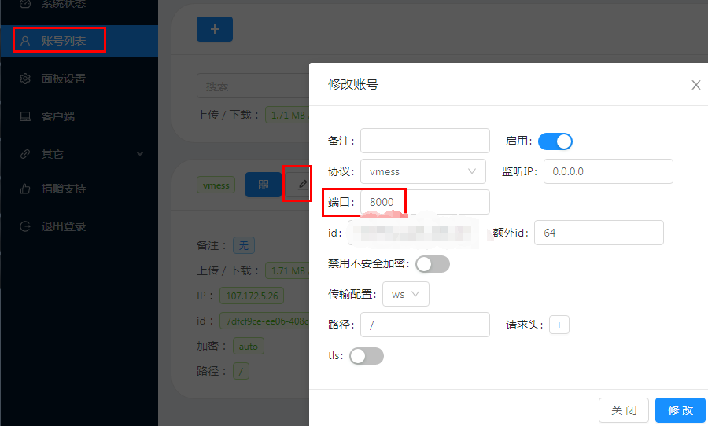
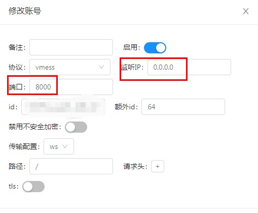

## v2ray 和 nginx 搭配

本文主要做下面几个事情

- [x] 自定义 v2ray 端口，通过 nginx 让原有的工作流正常运行
- [x] 通过域名来访问 v2-ui
- [ ] 部署 web 项目

阅读此文的前提是：

> 你已经配置了 v2ray + CDN + websocket，最好是通过 [v2-ui](https://github.com/sprov065/v2-ui) 配置的 v2ray

我们一步步来

### 假设一些变量，方便大家配置

- 服务器 IP: 108.172.5.29
- 域名：example.com
- 给 `v2ray` 科学上网用的子域名：`v2ray.example.com`
- 给 `v2-ui` 用的子域名：`v2-ui.example.com`
- `v2ray` 默认端口：`80`
- `v2ray` 自定义端口：`8000`

### 自定义 `v2ray` 的端口

- 打开你的 v2-ui 网址，`http://108.172.5.29:65432/v2ray/accounts/`
- 用浏览器访问你服务器的 ip 加 `v2ray` 端口（默认情况下，占用的是 80 端口），在这里就是 `http://108.172.5.29:80` 或者 `http://v2ray.example.com:80`

  正常情况下，你会看到 `Bad Request` ，看到 `Bad Request` 说明你的 v2ray 正常运行在 80 端口，如果你的端口改成其他端口，你去访问那个端口，看到的结果也应该是一样的

  _实际上，80 端口也是网页默认端口，所以通常可以省略。_

  这里我们改成 8000 端口（如下图），然后我们访问 http://108.172.5.29:8000，也会看到 `Bad Request`

  

  - _为什么不用默认的 80 端口而要自定义呢？因为这台服务器可能会放多个 web 项目，而这些项目通常都是通过域名来访问的且没有端口（也就是默认端口 80），所以 Nginx 要占用 80 端口，从而根据域名，把这些 web 项目的请求转发到对应的地址。如果有其他程序，譬如 v2ray 占据了 80 端口，Nginx 就无法转发不同域名（即 80 端口）上的请求_

  - _注意改完生效后，vpn 就立马不能用了，除非你改回来；不能用的原因是，cloudflare 只转发到特定的端口（通常是 80，443），并不支持自定义端口_

### 配置 Nginx

现在我们修改了 `v2ray` 的端口，但是 cloudflare 仍然会把对 `v2ray.example.com` 的请求转发到 `80` 端口，也就是 `v2ray.example.com:80`，如果要让 vpn 继续运行，我们就要

> 把域名为 `v2ray.example.com` 端口为 `80` 的请求，转发到服务器本地的 `v2ray` 端口

在这里就是 http://0.0.0.0:8000，这个地址是我们的 v2-ui 监听 IP 和端口的组合，如图：



那么我们开始

1. 登陆自己的服务器，下载安装运行 Nginx

2. 然后我们可以看下 nginx 的配置文件，我的服务器是 Centos 7 系统

```shell
cat /etc/nginx/nginx.conf # 查看 nginx 配置
```

我们会看到类似的代码

```shell
include /etc/nginx/conf.d/*.conf;
```

意思应该是，_/etc/nginx/conf.d_ 目录下的以 _.conf_ 为后缀的文件都会被包括进来。

3. 所以我们要切换到那个目录，新增一个文件，譬如 _v2ray.conf_，内容是

```shell
server {
  listen 80;
  listen [::]:80;

  server_name v2ray.example.com

  # path here should equal path in v2ray websocket path
  location / {
    proxy_redirect off;
    proxy_pass http://0.0.0.0:8000;
    proxy_http_version 1.1;
    proxy_set_header Upgrade $http_upgrade;
    proxy_set_header Connection "upgrade";
    proxy_set_header Host $http_host;

  }
}
```

注意这里的 `v2ray.example.com` 要根据自己的情况修改，改好后，重启 nginx

```shell
nginx -s reload
```

4. 重启后，再访问 `http://v2ray.example.com` 应该看到的就是 `Bad Request`，这说明转发成功了，如果没有看到，说明失败了，需要自己查看下 nginx 错误日志。

_在 nginx 默认配置文件里，有写这个日志文件地址。譬如，我查看默认配置文件 `cat /etc/nginx/nginx.conf`，在顶部就能看到 `error_log /var/log/nginx/error.log;` 然后打开那个错误日志，根据错误日志去找答案。_

Nginx 转发成功的话，重新开启翻墙，vpn 应该是正常运行的了。

### 通过域名来访问 v2-ui

如果你把上面的思路，理一理，那这一步，其实应该可以自己配了。

按照上面假设，v2-ui 的地址是 `http://108.172.5.29:65432/`，如果我们加一个子域名，譬如 `v2-ui.example.com`，那么我们就要把 `http://v2-ui.example.com` 的请求转发给 `http://108.172.5.29:65432/` 就好了。

- 首先，在 cloudflare 或者她的 partner 或 dnspod 上添加上 dns 解析记录，将 `v2-ui.example.com` 解析到你的服务器 IP。

- 然后，让 Nginx 把对 `v2-ui.example.com` 的请求转发给 `http://108.172.5.29:65432` ，也就是需要在 `nginx` 的配置目录 _/etc/nginx/conf.d_ 里，加一个文件，譬如 _v2-ui.conf_，里面配置下面代码

  ```shell
  server {
      listen 80;
      listen [::]:80;

      server_name v2-ui.example.com;

      location / {
          proxy_redirect off;
          proxy_pass http://0.0.0.0:65432;
      }
  }
  ```

  _**注意**，`v2-ui.example.com` 需要换成你自己的域名，转发的地址一般是 `http://0.0.0.0:65432`，如果你改了端口，就相应的改下端口，`0.0.0.0` 是访问你服务器本地的 v2-ui，不用换成 ip，方便迁移，除非你要转发另一台服务器的 v2-ui。_

- 改完后，验证重启 `nginx`。

```shell
nginx -t # 验证格式
nginx -s reload # 重启
```

现在就可以通过 `http://v2-ui.example.com` 访问了。

### 部署 web 项目

其实跟上面类似，暂时不写了

### 经常用到的一些命令

- 查看端口占用情况

  ```shell
  netstat -tplun
  ```

- 查看某项系统服务是否运行，以 nginx 为例

  ```shell
  systemctl status nginx
  ```

  运行这个命令的前提是，已经把它纳入系统服务了，就是之前执行过

  ```shell
  systemctl enable nginx
  ```

- 放开端口上的防火墙（否则外界无法访问）

  ```shell
  firewall-cmd --zone=public --add-port=8000/tcp --permanent
  firewall-cmd --reload #重启firewall
  ```
